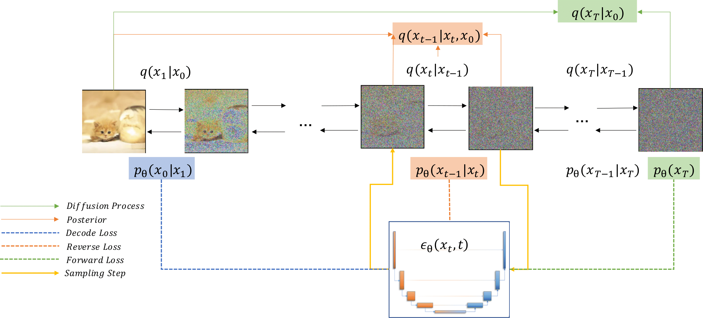
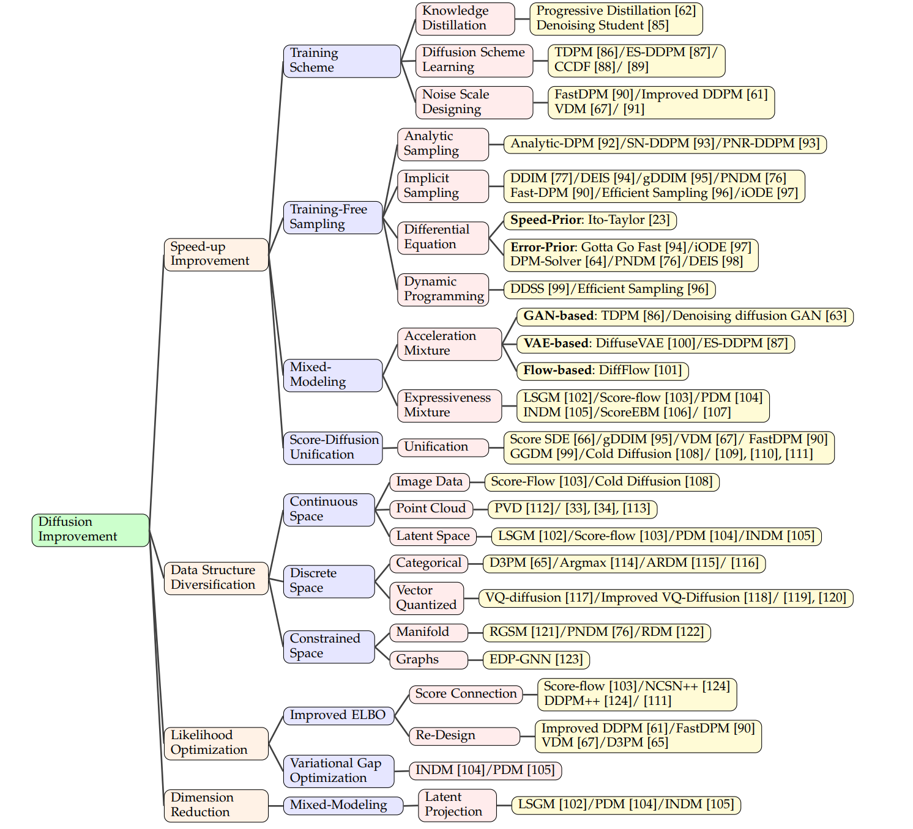
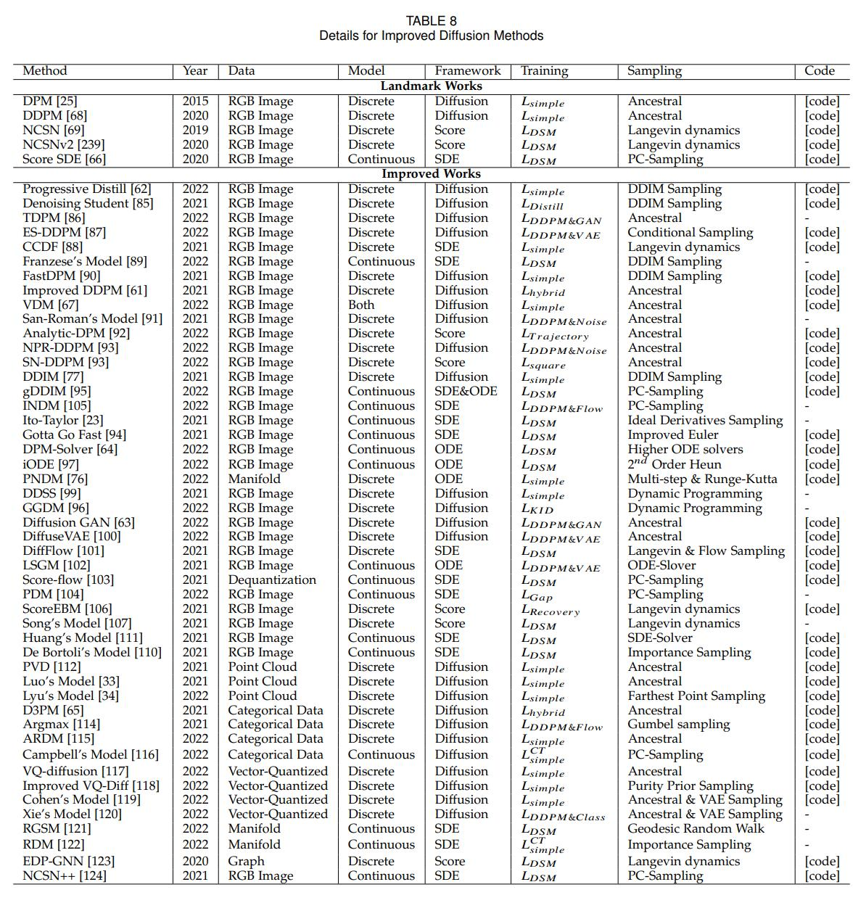
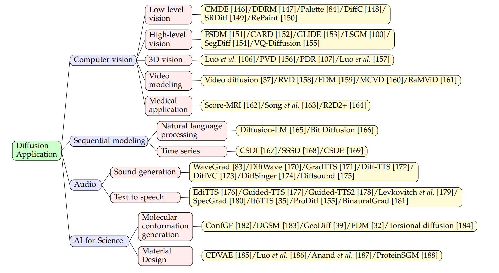
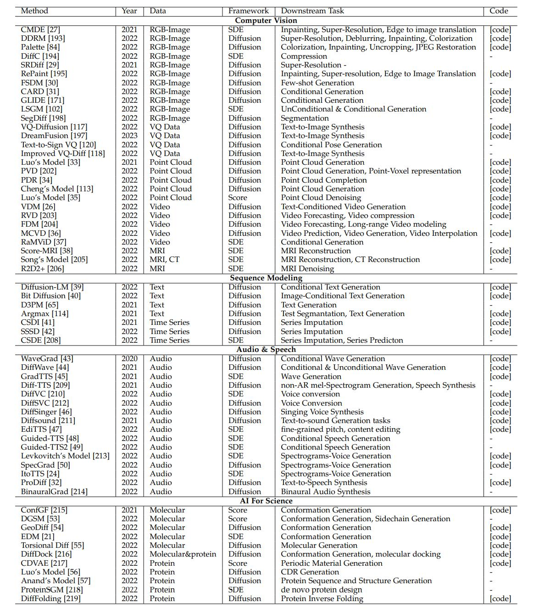

# A-Survey-on-Generative-Diffusion-Model

[](https://awesome.re)    


A curated list for diffusion generative models introduced by the paper--[_**A Survey on Generative Diffusion Model**_](https://arxiv.org/pdf/2209.02646.pdf)


## Table of Contents
- [0. Overview](#0-Overview)
- [1. Methodology Improvement](#1-Methodology-Improvement)
  <!-- - [Variational Gap Optimization](#Variational-Gap-Optimization) -->
  <!-- - [Dimension Deduction](#Dimension-Deduction) -->
  - [1.1 Speed-up](#11-Speed-up)
    - [1.1.1 Training Scheme](#111-Training-Scheme)
    - [1.1.2 Training-Free Sampling](#112-Training-Free-Sampling)
    - [1.1.3 Mixed-Modeling](#113-Mixed-Modeling)
    - [1.1.4 Score-Diffusion Unification](#114-Score-Diffusion-Unification)
  - [1.2 Distribution Diversification](#12-Distribution-Diversification)
    - [1.2.1 Continuous Space](#121-Continuous-Space)
    - [1.2.2 Discrete Space](#122-Discrete-Space)
    - [1.2.3 Constrained Space](#123-Constrained-Space)
  - [1.3 Likelihood Optimization](#13-Likelihood-Optimization)
    - [1.3.1 Improved ELBO](#131-Improved-ELBO)
    - [1.3.2 Variational Gap Optimization](#132-Variational-Gap-Optimization)
  - [1.4 Dimension Reduction](#14-Dimension-Reduction)
    - [1.4.1 Mixed Modeling](#141-Mixed-Modeling)
- [2 Application](#2-Application)
  - [2.1 Computer Vision](#21-Computer-Vision)
    - [2.1.1 Low-level Vision](#211-Low-level-Vision)
    - [2.1.2 High-level Vision](#212-High-level-Vision)
    - [2.1.3 3D Vision](#213-3D-Vision)
    - [2.1.4 Video Modeling](#214-Video-Modeling)
    - [2.1.5 Medical Application](#215-Medical-Application)
  - [2.2 Sequential Modeling](#22-Sequential-Modeling)
    - [2.2.1 Natural Language Processing](#221-Natural-Language-Processing)
    - [2.2.2 Time Series](#222-Time-Series)
  - [2.3 Audio](#23-Audio)
    - [2.3.1 Sound Generation](#231-Sound-Generation)
    - [2.3.2 Text to Speech](#232-Text-to-Speech)
  - [2.4 AI for Science](#24-AI-for-Science)
    - [2.4.1 Molecular Conformation Generation](#241-Molecular-Conformation-Generation)
    - [2.4.2 Material Design](#242-Material-Design)

<!-- - [A Summary of Methodology Details](#A-Summary-of-Methodology-Details)
- [A Summary of Implementation Details](#A-Summary-of-Implementation-Details)
- [A Summary of Common Graph Datasets](#A-Summary-of-Common-Graph-Datasets)
- [A Summary of Open-source Codes](#A-Summary-of-Open-source-Codes) -->

## 0. Overview

The original idea of the diffusion probabilistic model is to recreate a specific distribution that starts with random noise. 

**We provided [Diffusion Model.pdf](https://github.com/chq1155/A-Survey-on-Generative-Diffusion-Model/blob/main/prez/Diffusion%20Model.pdf), the slide that serves as a vivid explanation for our article. Here, we not only thank for the articles cited in our survey, but also thank the "Tutorial on Denoising Diffusion-based Generative Modeling: Foundations and Applications" provided by NVIDIA [tutorial](https://www.youtube.com/watch?v=cS6JQpEY9cs&t=7827s&ab_channel=ArashVahdat). Besides, there's also two GitHub Repos for summarizing the up-to-date articles, [Awesome-Diffusion-Models](https://github.com/heejkoo/Awesome-Diffusion-Models) and [What is the Score?](https://scorebasedgenerativemodeling.github.io/). Thank you for your contribution!**

<p align="center">
  
</p>

## 1. Methodology Improvement
<!-- ### Variational Gap Optimization -->
<!-- ### Dimension Deduction -->

Nowadays, the main concern of the diffusion model is to speed up its speed and reduce the cost of computing. In general cases, it takes thousands of steps for diffusion models to generate a high-quality sample. Mainly focusing on improving sampling speed, many works from different aspects come into reality. Besides, other problems such as variational gap optimization, distribution diversification, and dimension reduction are also attracting extensive research interests. We divide the improved algorithm w.r.t. problems to be solved. For each problem, we present detailed classification of solutions.

<p align="center">
  
</p>

### 1.1 Speed-up
#### 1.1.1 Training Scheme

***Knowledge DIstillation***
 - **Progressive distillation for fast sampling of diffusion models**
    - Salimans, Tim and Ho, Jonathan. *ICLR 2022*. [[pdf]](https://arxiv.org/abs/2202.00512) [[code]](https://github.com/google-research/google-research/tree/master/diffusion_distillation) <!-- TODO: Update version -->

 - **ProDiff: Progressive Fast Diffusion Model For High-Quality Text-to-Speech**
    - Huang, Rongjie and Zhao, Zhou and Liu, Huadai and Liu, Jinglin and Cui, Chenye and Ren, Yi. *ACM MM 2022*. [[pdf]](https://arxiv.org/abs/2207.06389) [[code]](https://github.com/Rongjiehuang/ProDiff) <!-- TODO: Update version -->

 - **Knowledge Distillation in Iterative Generative Models for Improved Sampling Speed**
    - Luhman, Eric and Luhman, Troy. *Arxiv 2021* [[pdf]](https://arxiv.org/abs/2101.02388) [[code]](https://github.com/tcl9876/Denoising_Student) <!-- TODO: Cite in text -->


***Diffusion Scheme Learning***
 - **Accelerating Diffusion Models via Early Stop of the Diffusion Process**
    - Lyu, Zhaoyang and Xu, Xudong and Yang, Ceyuan and Lin, Dahua and Dai, Bo. *Arxiv 2022* [[pdf]](https://arxiv.org/abs/2205.12524) [[code]](https://github.com/zhaoyanglyu/early_stopped_ddpm)
 
 - **Truncated diffusion probabilistic models**
    - Zheng, Huangjie and He, Pengcheng and Chen, Weizhu and Zhou, Mingyuan. *Arxiv 2022* [[pdf]](https://arxiv.org/abs/2202.09671)

 - **Cold Diffusion: Inverting Arbitrary Image Transforms Without Noise**
    - Bansal, Arpit and Borgnia, Eitan and Chu, Hong-Min and Li, Jie S. and Kazemi, Hamid and Huang, Furong and Goldblum, Micah and Geiping, Jonas and Goldstein, Tom. *Arxiv 2022* [[pdf]](https://arxiv.org/abs/2208.09392) [[code]](https://github.com/arpitbansal297/cold-diffusion-models)

 - **How Much is Enough? A Study on Diffusion Times in Score-based Generative Models**
    - Franzese, Giulio and Rossi, Simone and Yang, Lixuan and Finamore, Alessandro and Rossi, Dario and Filippone, Maurizio and Michiardi, Pietro. *Arxiv 2022* [[pdf]](https://arxiv.org/abs/2206.05173)

***Noise Scale Designing* **
 - **Improved denoising diffusion probabilistic models**
    - Nichol, Alexander Quinn and Dhariwal, Prafulla. *PMLR 2021* [[pdf]](https://arxiv.org/abs/2102.09672) [[code]](https://github.com/openai/improved-diffusion)

 - **Noise estimation for generative diffusion models**
    - San-Roman, Robin and Nachmani, Eliya and Wolf, Lior. *Arxiv 2021* [[pdf]](https://arxiv.org/abs/2104.02600)

 - **Fast Sampling of Diffusion Models with Exponential Integrator**
    - Zhang, Qinsheng and Chen, Yongxin. *Arxiv 2022* [[pdf]](https://arxiv.org/abs/2204.13902) [[code]](https://github.com/qsh-zh/deis)

 - **Variational diffusion models**
    - Kingma, Diederik and Salimans, Tim and Poole, Ben and Ho, Jonathan. *NIPS 2021* [[pdf]](https://arxiv.org/abs/2107.00630) [[code]](https://github.com/google-research/vdm)

***Data Distribution Replace***
 - **Cold Diffusion: Inverting Arbitrary Image Transforms Without Noise**
    - Bansal, Arpit and Borgnia, Eitan and Chu, Hong-Min and Li, Jie S. and Kazemi, Hamid and Huang, Furong and Goldblum, Micah and Geiping, Jonas and Goldstein, Tom. *Arxiv 2022* [[pdf]](https://arxiv.org/abs/2208.09392) [[code]](https://github.com/arpitbansal297/cold-diffusion-models)
 
 - **Structured denoising diffusion models in discrete state-spaces**
    - Austin, Jacob and Johnson, Daniel D and Ho, Jonathan and Tarlow, Daniel and van den Berg, Rianne. *NIPS 2021* [[pdf]](https://arxiv.org/abs/2107.03006) [[code]](https://paperswithcode.com/paper/structured-denoising-diffusion-models-in)


#### 1.1.2 Training-Free Sampling
***Analytical Method***
 - **Analytic-dpm: an analytic estimate of the optimal reverse variance in diffusion probabilistic models**
    - Bao, Fan and Li, Chongxuan and Zhu, Jun and Zhang, Bo. *Arxiv 2022*. [[pdf]](https://arxiv.org/abs/2201.06503) [[code]](https://github.com/baofff/Analytic-DPM)

***Implicit Sampler***
 - **Denoising Diffusion Implicit Models**
    - Song, Jiaming and Meng, Chenlin and Ermon, Stefano. *ICLR 2020*. [[pdf]](https://arxiv.org/abs/2010.02502) [[code]](https://github.com/ermongroup/ddim)

 - **gDDIM: Generalized denoising diffusion implicit models**
    - Zhang, Qinsheng and Tao, Molei and Chen, Yongxin. *Arxiv 2022*. [[pdf]](https://arxiv.org/abs/2206.05564) [[code]](https://github.com/qsh-zh/gDDIM)
 
 - **Maximum Likelihood Training of Implicit Nonlinear Diffusion Models**
    - Kim, Dongjun and Na, Byeonghu and Kwon, Se Jung and Lee, Dongsoo and Kang, Wanmo and Moon, Il-Chul. *Arxiv 2022*. [[pdf]](https://arxiv.org/abs/2205.13699) 

***Differential Equation Solver Sampler***
- **Fast Sampling of Diffusion Models with Exponential Integrator**
    - Zhang, Qinsheng and Chen, Yongxin. *Arxiv 2022* [[pdf]](https://arxiv.org/abs/2204.13902) [[code]](https://github.com/qsh-zh/deis)

- **Pseudo numerical methods for diffusion models on manifolds**
    - Liu, Luping and Ren, Yi and Lin, Zhijie and Zhao, Zhou. *ICLR 2022*. [[pdf]](https://arxiv.org/abs/2202.09778) [[code]](https://github.com/luping-liu/PNDM) <!-- TODO: Update version -->

- **DPM-Solver: A Fast ODE Solver for Diffusion Probabilistic Model Sampling in Around 10 Steps**
    - Lu, Cheng and Zhou, Yuhao and Bao, Fan and Chen, Jianfei and Li, Chongxuan and Zhu, Jun. *Arxiv 2022* [[pdf]](https://arxiv.org/abs/2206.00927) [[code]](https://github.com/luchengthu/dpm-solver) 

- **Gotta Go Fast When Generating Data with Score-Based Models**
    - Jolicoeur-Martineau, Alexia and Li, Ke and Piché-Taillefer, Rémi and Kachman, Tal and Mitliagkas, Ioannis. *Arxiv 2022* [[pdf]](https://arxiv.org/abs/2105.14080) [[code]](https://github.com/AlexiaJM/score_sde_fast_sampling) 

***Dynamic Programming Adjustment***
- **Learning Fast Samplers for Diffusion Models by Differentiating Through Sample Quality**
    - Watson, Daniel and Chan, William and Ho, Jonathan and Norouzi, Mohammad. *ICLR 2022*. [[pdf]](https://arxiv.org/abs/2202.05830) 

- **Learning to efficiently sample from diffusion probabilistic models**
    - Watson, Daniel and Ho, Jonathan and Norouzi, Mohammad and Chan, William. *Arxiv 2021*. [[pdf]](https://arxiv.org/abs/2106.03802)  


<!-- TODO: 此前的引用, 结合自正文段落和图, 接下来的应用仅仅是图上的引用, 可能忽略段落中的部分内容. -->
#### 1.1.3 Mixed-Modeling
*Acceleration Mixture* 
- **Tackling the generative learning trilemma with denoising diffusion gans**
    - Xiao, Zhisheng and Kreis, Karsten and Vahdat, Arash. *Arxiv 2021* [[pdf]](https://arxiv.org/abs/2112.07804) [[code]](https://github.com/NVlabs/denoising-diffusion-gan) 

- **Accelerating Diffusion Models via Early Stop of the Diffusion Process**
    - Lyu, Zhaoyang and Xu, Xudong and Yang, Ceyuan and Lin, Dahua and Dai, Bo. *Arxiv 2022*. [[pdf]](http://arxiv.org/abs/2205.12524) [[code]](https://github.com/zhaoyanglyu/early_stopped_ddpm) 

- **Truncated diffusion probabilistic models**
    - Zheng, Huangjie and He, Pengcheng and Chen, Weizhu and Zhou, Mingyuan. *Arxiv 2022*. [[pdf]](https://arxiv.org/abs/2202.09671) [[code]](https://github.com/jegzheng/truncated-diffusion-probabilistic-models) 

- **DiffuseVAE: Efficient, Controllable and High-Fidelity Generation from Low-Dimensiona Latents**
    - Pandey, Kushagra and Mukherjee, Avideep and Rai, Piyush and Kumar, Abhishek. *Arixv 2022*. [[pdf]](https://arxiv.org/pdf/2201.00308) [[code]](https://github.com/kpandey008/DiffuseVAE) 

- **Diffusion normalizing flow**
    - Zhang, Qinsheng and Chen, Yongxin. *NIPS 2021*. [[pdf]](https://arxiv.org/abs/2110.07579) [[code]](https://github.com/qsh-zh/DiffFlow) 

*Expressiveness Mixture*

 - **Maximum Likelihood Training of Implicit Nonlinear Diffusion Models**
    - Kim, Dongjun and Na, Byeonghu and Kwon, Se Jung and Lee, Dongsoo and Kang, Wanmo and Moon, Il-Chul. *Arxiv 2022*. [[pdf]](https://arxiv.org/abs/2205.13699) 

- **Score-based generative modeling in latent space**
    - Vahdat, Arash and Kreis, Karsten and Kautz, Jan. *NIPS 2021*. [[pdf]](https://arxiv.org/abs/2106.05931) [[code]](https://github.com/NVlabs/LSGM) 

- **Maximum likelihood training of score-based diffusion models**
    - Song, Yang and Durkan, Conor and Murray, Iain and Ermon, Stefano. *NIPS 2021*. [[pdf]](https://arxiv.org/abs/2101.09258) [[code]](https://github.com/yang-song/score_flow)

- **Maximum Likelihood Training of Parametrized Diffusion Model**
    - Kim, Dongjun and Na, Byeonghu and Kwon, Se Jung and Lee, Dongsoo and Kang, Wanmo and Moon, Il-chul. [[pdf]](https://paperswithcode.com/paper/maximum-likelihood-training-of-parametrized)

#### 1.1.4 Score-Diffusion Unification
- **Score-based generative modeling through stochastic differential equations**
    - Song, Yang and Sohl-Dickstein, Jascha and Kingma, Diederik P and Kumar, Abhishek and Ermon, Stefano and Poole, Ben. *Arxiv 2020*. [[pdf]](https://arxiv.org/abs/2011.13456) [[code]](https://github.com/yang-song/score_sde)


- **Variational diffusion models**
    - Kingma, Diederik and Salimans, Tim and Poole, Ben and Ho, Jonathan. *NIPS 2021* [[pdf]](https://arxiv.org/abs/2107.00630) [[code]](https://github.com/google-research/vdm)

 - **gDDIM: Generalized denoising diffusion implicit models**
    - Zhang, Qinsheng and Tao, Molei and Chen, Yongxin. *Arxiv 2022*. [[pdf]](https://arxiv.org/abs/2206.05564) [[code]](https://github.com/qsh-zh/gDDIM)

- **Fast Sampling of Diffusion Models with Exponential Integrator**
    - Zhang, Qinsheng and Chen, Yongxin. *Arxiv 2022* [[pdf]](https://arxiv.org/abs/2204.13902) [[code]](https://github.com/qsh-zh/deis)

- **Learning Fast Samplers for Diffusion Models by Differentiating Through Sample Quality**
    - Watson, Daniel and Chan, William and Ho, Jonathan and Norouzi, Mohammad. *ICLR 2022*. [[pdf]](https://arxiv.org/abs/2202.05830) 

- **Interpreting diffusion score matching using normalizing flow**
    - Gong, Wenbo and Li, Yingzhen. *Arxiv 2021*. [[pdf]](https://arxiv.org/abs/2107.10072)

- **Simulating Diffusion Bridges with Score Matching**
    - De Bortoli, Valentin and Doucet, Arnaud and Heng, Jeremy and Thornton, James. *Arxiv 2021*. [[pdf]](https://arxiv.org/abs/2111.07243) [[code]](https://github.com/jeremyhengjm/diffusionbridge)

### 1.2 Distribution Diversification
#### 1.2.1 Continuous Space
- **Maximum Likelihood Training of Implicit Nonlinear Diffusion Models**
    - Kim, Dongjun and Na, Byeonghu and Kwon, Se Jung and Lee, Dongsoo and Kang, Wanmo and Moon, Il-Chul. *Arxiv 2022*. [[pdf]](https://arxiv.org/abs/2205.13699) 

- **Score-based generative modeling in latent space**
    - Vahdat, Arash and Kreis, Karsten and Kautz, Jan. *NIPS 2021*. [[pdf]](https://arxiv.org/abs/2106.05931) [[code]](https://github.com/NVlabs/LSGM)

- **Maximum likelihood training of score-based diffusion models**
    - Song, Yang and Durkan, Conor and Murray, Iain and Ermon, Stefano. *NIPS 2021*. [[pdf]](https://arxiv.org/abs/2101.09258) [[code]](https://github.com/yang-song/score_flow)

- **Maximum Likelihood Training of Parametrized Diffusion Model**
    - Kim, Dongjun and Na, Byeonghu and Kwon, Se Jung and Lee, Dongsoo and Kang, Wanmo and Moon, Il-chul. [[pdf]](https://paperswithcode.com/paper/maximum-likelihood-training-of-parametrized)

- **Diffusion probabilistic models for 3d point cloud generation**
    - Luo, Shitong and Hu, Wei. *CVPR 2021*. [[pdf]](https://arxiv.org/abs/2103.01458) [[code]](https://github.com/luost26/diffusion-point-cloud)

- **3d shape generation and completion through point-voxel diffusion**
    - Zhou, Linqi and Du, Yilun and Wu, Jiajun. *ICCV 2021*. [[pdf]](https://arxiv.org/abs/2104.03670) [[code]](https://github.com/alexzhou907/PVD)

- **A Conditional Point Diffusion-Refinement Paradigm for 3D Point Cloud Completion**
    - Lyu, Zhaoyang and Kong, Zhifeng and Xudong, XU and Pan, Liang and Lin, Dahua. *ICLR 2021*. [[pdf]](https://arxiv.org/abs/2112.03530) [[code]](https://github.com/zhaoyanglyu/point_diffusion_refinement)

#### 1.2.2 Discrete Space
- **Argmax flows and multinomial diffusion: Towards non-autoregressive language models**
    - Hoogeboom, Emiel and Nielsen, Didrik and Jaini, Priyank and Forre, Patrick and Welling, Max. *NIPS 2021*. [[pdf]](https://arxiv.org/abs/2102.05379) [[code]](https://github.com/ehoogeboom/multinomial_diffusion)

- **Autoregressive diffusion models**
    - Hoogeboom, Emiel and Gritsenko, Alexey A and Bastings, Jasmijn and Poole, Ben and Berg, Rianne van den and Salimans, Tim. *Arxiv 2021*. [[pdf]](https://arxiv.org/abs/2110.02037) [[code]](https://github.com/google-research/google-research/tree/master/autoregressive_diffusion)

- **A Continuous Time Framework for Discrete Denoising Models**
    - Campbell, Andrew and Benton, Joe and De Bortoli, Valentin and Rainforth, Tom and Deligiannidis, George and Doucet, Arnaud. *Arxiv 2022*. [[pdf]](http://arxiv.org/abs/2205.14987) [[code]](https://github.com/andrew-cr/tauldr)

- **Structured denoising diffusion models in discrete state-spaces**
    - Austin, Jacob and Johnson, Daniel D and Ho, Jonathan and Tarlow, Daniel and van den Berg, Rianne. *NIPS 2021* [[pdf]](https://arxiv.org/abs/2107.03006) [[code]](https://paperswithcode.com/paper/structured-denoising-diffusion-models-in)

- **Improved Vector Quantized Diffusion Models**
    - Tang, Zhicong and Gu, Shuyang and Bao, Jianmin and Chen, Dong and Wen, Fang. *Arxiv 2022*. [[pdf]](https://arxiv.org/abs/2205.16007) [[code]](https://github.com/microsoft/vq-diffusion)

- **Diffusion bridges vector quantized Variational AutoEncoders**
    - Cohen, Max and Quispe, Guillaume and Corff, Sylvain Le and Ollion, Charles and Moulines, Eric. *Arixv 2022*. [[pdf]](https://arxiv.org/abs/2202.04895) [[code]](https://github.com/maxjcohen/diffusion-bridges)

- **Vector Quantized Diffusion Model with CodeUnet for Text-to-Sign Pose Sequences Generation**
    - Xie, Pan and Zhang, Qipeng and Li, Zexian and Tang, Hao and Du, Yao and Hu, Xiaohui. *Arxiv 2022*. [[pdf]](http://arxiv.org/abs/2208.09141)

#### 1.2.3 Constrained Space
- **Pseudo numerical methods for diffusion models on manifolds**
    - Liu, Luping and Ren, Yi and Lin, Zhijie and Zhao, Zhou. *Arxiv 2022*. [[pdf]](https://arxiv.org/abs/2202.09778) [[code]](https://github.com/luping-liu/PNDM)

- **Riemannian score-based generative modeling**
    - De Bortoli, Valentin and Mathieu, Emile and Hutchinson, Michael and Thornton, James and Teh, Yee Whye and Doucet, Arnaud. *Arxiv 2022*. [[pdf]](https://arxiv.org/abs/2202.02763) [[code]](https://github.com/oxcsml/riemannian-score-sde)

- **Riemannian Diffusion Models**
    - Huang, Chin-Wei and Aghajohari, Milad and Bose, Avishek Joey and Panangaden, Prakash and Courville, Aaron. *Arxiv 2022*. [[pdf]](https://arxiv.org/abs/2207.03024?context=cs)

- **Permutation invariant graph generation via score-based generative modeling**
    - Niu, Chenhao and Song, Yang and Song, Jiaming and Zhao, Shengjia and Grover, Aditya and Ermon, Stefano. *PMLR 2020*. [[pdf]](https://arxiv.org/abs/2003.00638) [[code]](https://github.com/ermongroup/GraphScoreMatching)

### 1.3 Likelihood Optimization

#### 1.3.1 Improved ELBO
*Score Connection*
- **Maximum likelihood training of score-based diffusion models**
    - Song, Yang and Durkan, Conor and Murray, Iain and Ermon, Stefano. *NIPS 2021*. [[pdf]](https://arxiv.org/abs/2101.09258) [[code]](https://github.com/yang-song/score_flow)

- **Soft truncation: A universal training technique of score-based diffusion model for high precision score estimation**
    - Dongjun Kim, Seungjae Shin, Kyungwoo Song, Wanmo Kang, Il-Chul Moon. *ICML 2022*. [[pdf]](https://proceedings.mlr.press/v162/kim22i.html) [[code]](https://proceedings.mlr.press/v162/kim22i.html)
    
*Redesign*
- **Improved Denoising Diffusion Probabilistic Models**
    - Alex Nichol, Prafulla Dhariwal. *ICLR 2021*. [[pdf]](https://arxiv.org/abs/2102.09672) [[code]](https://github.com/openai/improved-diffusion)
    
- **Fast Sampling of Diffusion Models with Exponential Integrator**
    - Zhang, Qinsheng and Chen, Yongxin. *Arxiv 2022* [[pdf]](https://arxiv.org/abs/2204.13902) [[code]](https://github.com/qsh-zh/deis) 

- **Variational diffusion models**
    - Kingma, Diederik and Salimans, Tim and Poole, Ben and Ho, Jonathan. *NIPS 2021* [[pdf]](https://arxiv.org/abs/2107.00630) [[code]](https://github.com/google-research/vdm)
    
- **Structured denoising diffusion models in discrete state-spaces**
    - Austin, Jacob and Johnson, Daniel D and Ho, Jonathan and Tarlow, Daniel and van den Berg, Rianne. *NIPS 2021* [[pdf]](https://arxiv.org/abs/2107.03006) [[code]](https://paperswithcode.com/paper/structured-denoising-diffusion-models-in)
     

#### 1.3.2 Variational Gap Optimization

- **Score-based generative modeling in latent space**
    - Vahdat, Arash and Kreis, Karsten and Kautz, Jan. *NIPS 2021*. [[pdf]](https://arxiv.org/abs/2106.05931) [[code]](https://github.com/NVlabs/LSGM)

- **Maximum likelihood training of score-based diffusion models**
    - Song, Yang and Durkan, Conor and Murray, Iain and Ermon, Stefano. *NIPS 2021*. [[pdf]](https://arxiv.org/abs/2101.09258) [[code]](https://github.com/yang-song/score_flow)

- **Maximum Likelihood Training of Parametrized Diffusion Model**
    - Kim, Dongjun and Na, Byeonghu and Kwon, Se Jung and Lee, Dongsoo and Kang, Wanmo and Moon, Il-chul. [[pdf]](https://paperswithcode.com/paper/maximum-likelihood-training-of-parametrized)


### 1.4 Dimension Reduction

#### 1.4.1 Mixed-Modeling

- **Maximum likelihood training of score-based diffusion models**
    - Song, Yang and Durkan, Conor and Murray, Iain and Ermon, Stefano. *NIPS 2021*. [[pdf]](https://arxiv.org/abs/2101.09258) [[code]](https://github.com/yang-song/score_flow)

- **Maximum Likelihood Training of Parametrized Diffusion Model**
    - Kim, Dongjun and Na, Byeonghu and Kwon, Se Jung and Lee, Dongsoo and Kang, Wanmo and Moon, Il-chul. [[pdf]](https://paperswithcode.com/paper/maximum-likelihood-training-of-parametrized)


<p align="center">
  
</p>

## 2. Application
Benefiting from the powerful ability to generate realistic samples, diffusion models have been widely used in various fields such as computer vision, natural language processing, and bioinformatics.

<p align="center">
  
</p>

### 2.1 Computer Vision
#### 2.1.1 Low-level Vision
- **Palette: Image-to-image diffusion models**
    - Saharia, Chitwan and Chan, William and Chang, Huiwen and Lee, Chris and Ho, Jonathan and Salimans, Tim and Fleet, David and Norouzi, Mohammad. *ACM SIGGRAPH*. [[pdf]](https://arxiv.org/abs/2111.05826) [[code]](https://github.com/Janspiry/Palette-Image-to-Image-Diffusion-Models)

- **Conditional image generation with score-based diffusion models**
    - Batzolis, Georgios and Stanczuk, Jan and Schonlieb, Carola-Bibiane and Etmann, Christian. *Arxiv 2021*. [[pdf]](https://arxiv.org/abs/2111.13606) [[code]](https://paperswithcode.com/paper/conditional-image-generation-with-score-based)

- **Denoising Diffusion Restoration Models**
    - Kawar, Bahjat and Elad, Michael and Ermon, Stefano and Song, Jiaming. *ICLR 2022*. [[pdf]](https://arxiv.org/abs/2201.11793) [[code]](https://github.com/bahjat-kawar/ddrm)

- **Lossy Compression with Gaussian Diffusion**
    - Theis, Lucas and Salimans, Tim and Hoffman, Matthew D and Mentzer, Fabian. *Arxiv 2022*. [[pdf]](https://arxiv.org/abs/2206.08889)

- **Srdiff: Single image super-resolution with diffusion probabilistic models**
    - Li, Haoying and Yang, Yifan and Chang, Meng and Chen, Shiqi and Feng, Huajun and Xu, Zhihai and Li, Qi and Chen, Yueting. *Neurocomputing 2022*. [[pdf]](https://arxiv.org/abs/2104.14951) [[code]](https://github.com/LeiaLi/SRDiff)

- **Repaint: Inpainting using denoising diffusion probabilistic models**
    - Lugmayr, Andreas and Danelljan, Martin and Romero, Andres and Yu, Fisher and Timofte, Radu and Van Gool, Luc. *CVPR 2022*. [[pdf]](https://arxiv.org/abs/2201.09865) [[code]](https://github.com/andreas128/RePaint)

#### 2.1.2 High-level Vision
- **Score-based generative modeling in latent space**
    - Vahdat, Arash and Kreis, Karsten and Kautz, Jan. *NIPS 2021*. [[pdf]](https://arxiv.org/abs/2106.05931) [[code]](https://github.com/NVlabs/LSGM)

- **Few-Shot Diffusion Models**
    - Giannone, Giorgio and Nielsen, Didrik and Winther, Ole. *Arxiv 2022*。 [[pdf]](https://arxiv.org/abs/2205.15463)

- **CARD: Classification and Regression Diffusion Models**
    - Han, Xizewen and Zheng, Huangjie and Zhou, Mingyuan. *Arxiv 2022*. [[pdf]](http://arxiv.org/abs/2206.07275) [[code]](https://github.com/xzwhan/card)

- **Glide: Towards photorealistic image generation and editing with text-guided diffusion models**
    - Nichol, Alex and Dhariwal, Prafulla and Ramesh, Aditya and Shyam, Pranav and Mishkin, Pamela and McGrew, Bob and Sutskever, Ilya and Chen, Mark. *Arxiv 2021*. [[pdf]](https://arxiv.org/abs/2112.10741) [[code]](https://github.com/openai/glide-text2im)

- **Segdiff: Image segmentation with diffusion probabilistic models**
    - Amit, Tomer and Nachmani, Eliya and Shaharbany, Tal and Wolf, Lior. *Arxiv 2021*. [[pdf]](https://arxiv.org/abs/2112.00390) 

- **ProDiff: Progressive Fast Diffusion Model For High-Quality Text-to-Speech**
    - Huang, Rongjie and Zhao, Zhou and Liu, Huadai and Liu, Jinglin and Cui, Chenye and Ren, Yi. *ACM MM 2022*. [[pdf]](https://arxiv.org/abs/2207.06389) [[code]](https://github.com/Rongjiehuang/ProDiff) 
    
- **Diffusion Causal Models for Counterfactual Estimation**
    - Sanchez, Pedro and Tsaftaris, Sotirios A. *Conference on Causal Learning and Reasoning (CLeaR) 2022*. [[pdf]](https://arxiv.org/abs/2202.10166) [[code]](https://github.com/vios-s/diff-scm) 

#### 2.1.3 3D Vision
- **Diffusion probabilistic models for 3d point cloud generation**
    - Luo, Shitong and Hu, Wei. *CVPR 2021*. [[pdf]](https://arxiv.org/abs/2103.01458) [[code]](https://github.com/luost26/diffusion-point-cloud) 

- **A conditional point diffusion-refinement paradigm for 3d point cloud completion**
    - Lyu, Zhaoyang and Kong, Zhifeng and Xu, Xudong and Pan, Liang and Lin, Dahua. *Arxiv 2021*. [[pdf]](https://arxiv.org/abs/2112.03530) [[code]](https://github.com/zhaoyanglyu/point_diffusion_refinement) 

- **3D Shape Generation and Completion Through Point-Voxel Diffusion**
    - Zhou, Linqi and Du, Yilun and Wu, Jiajun. *ICCV 2021*. [[pdf]](https://arxiv.org/abs/2104.03670) [[code]](https://github.com/alexzhou907/PVD) 

- **Score-based point cloud denoising**
    - Luo, Shitong and Hu, Wei. *ICCV 2021*. [[pdf]](https://arxiv.org/abs/2107.10981) [[code]](https://github.com/luost26/score-denoise) 
    
#### 2.1.4 Video Modeling
- **Video Diffusion Models**
    - Ho, Jonathan and Salimans, Tim and Gritsenko, Alexey A and Chan, William and Norouzi, Mohammad and Fleet, David J. *ICLR Workshop 2022*. [[pdf]](https://arxiv.org/abs/2204.03458)

- **Diffusion probabilistic modeling for video generation**
    - Yang, Ruihan and Srivastava, Prakhar and Mandt, Stephan. *Arxiv 2022*. [[pdf]](https://arxiv.org/abs/2203.09481) [[code]](https://github.com/buggyyang/rvd)

- **Flexible diffusion modeling of long videos**
    - Harvey, William and Naderiparizi, Saeid and Masrani, Vaden and Weilbach, Christian and Wood, Frank. *Arxiv 2022*. [[pdf]](https://arxiv.org/abs/2205.11495) [[code]](https://github.com/plai-group/flexible-video-diffusion-modeling)

- **MCVD: Masked Conditional Video Diffusion for Prediction, Generation, and Interpolation**
    - Voleti, Vikram and Jolicoeur-Martineau, Alexia and Pal, Christopher. *Arxiv 2022*. [[pdf]](http://arxiv.org/abs/2205.09853) [[code]](https://github.com/voletiv/mcvd-pytorch)

- **Diffusion models for video prediction and infilling**
    - Hoppe, Tobias and Mehrjou, Arash and Bauer, Stefan and Nielsen, Didrik and Dittadi, Andrea. *Arxiv 2022*. [[pdf]](https://arxiv.org/abs/2206.07696) [[code]](https://github.com/Tobi-r9/RaMViD)

#### 2.1.5 Medical Application
- **Score-based diffusion models for accelerated MRI**
    - Chung, Hyungjin and Ye, Jong Chul. *Medical Image Analysis 2022*. [[pdf]](https://arxiv.org/abs/2110.05243) [[code]](https://github.com/HJ-harry/score-MRI)

- **Solving Inverse Problems in Medical Imaging with Score-Based Generative Models**
    - Song, Yang and Shen, Liyue and Xing, Lei and Ermon, Stefano. *ICLR 2021*. [[pdf]](https://arxiv.org/abs/2111.08005) [[code]](https://github.com/yang-song/score_inverse_problems)

- **MR Image Denoising and Super-Resolution Using Regularized Reverse Diffusion**
    - Chung, Hyungjin and Lee, Eun Sun and Ye, Jong Chul. *Arxiv 2022*. [[pdf]](https://arxiv.org/abs/2203.12621)
    
- **What is Healthy? Generative Counterfactual Diffusion for Lesion Localization**
    - Sanchez, Pedro and Kascenas, Antanas and Liu, Xiao and O'Neil, Alison Q and Tsaftaris, Sotirios A. *Arxiv 2022*. [[pdf]](https://arxiv.org/abs/2207.12268) [[code]](https://github.com/vios-s/diff-scm)

### 2.2 Sequential Modeling
#### 2.2.1 Natural Language Processing
- **Diffusion-LM Improves Controllable Text Generation**
    - Li, Xiang Lisa and Thickstun, John and Gulrajani, Ishaan and Liang, Percy and Hashimoto, Tatsunori B. *Arxiv 2022*. [[pdf]](https://arxiv.org/abs/2205.14217) [[code]](https://github.com/xiangli1999/diffusion-lm)

- **Analog Bits: Generating Discrete Data using Diffusion Models with Self-Conditioning**
    - Chen, Ting and Zhang, Ruixiang and Hinton, Geoffrey. *Arxiv 2022*. [[pdf]](https://arxiv.org/abs/2208.04202) [[code]](https://github.com/lucidrains/bit-diffusion)

#### 2.2.2 Time Series
- **CSDI: Conditional score-based diffusion models for probabilistic time series imputation**
    - Tashiro, Yusuke and Song, Jiaming and Song, Yang and Ermon, Stefano. *NIPS 2021*. [[pdf]](https://arxiv.org/abs/2107.03502) [[code]](https://github.com/ermongroup/csdi)

- **Diffusion-based Time Series Imputation and Forecasting with Structured State Space Models**
    - Alcaraz, Juan Miguel Lopez and Strodthoff, Nils. *Arxiv 2022*. [[pdf]](http://arxiv.org/abs/2208.09399) [[code]](https://github.com/ai4healthuol/sssd)

- **Neural Markov Controlled SDE: Stochastic Optimization for Continuous-Time Data**
    - Park, Sung Woo and Lee, Kyungjae and Kwon, Junseok. *ICLR 2021*. [[pdf]](https://openreview.net/forum?id=7DI6op61AY)

### 2.3 Audio
#### 2.3.1 Sound Generation
- **Palette: Image-to-image diffusion models**
    - Saharia, Chitwan and Chan, William and Chang, Huiwen and Lee, Chris and Ho, Jonathan and Salimans, Tim and Fleet, David and Norouzi, Mohammad. *ACM SIGGRAPH*. [[pdf]](https://arxiv.org/abs/2111.05826) [[code]](https://github.com/Janspiry/Palette-Image-to-Image-Diffusion-Models)

- **DiffWave: A Versatile Diffusion Model for Audio Synthesis**
    - Kong, Zhifeng and Ping, Wei and Huang, Jiaji and Zhao, Kexin and Catanzaro, Bryan. *ICLR 2020*. [[pdf]](https://arxiv.org/abs/2009.09761) [[code]](https://diffwave-demo.github.io/)

- **Grad-TTS: A diffusion probabilistic model for text-to-speech**
    - Popov, Vadim and Vovk, Ivan and Gogoryan, Vladimir and Sadekova, Tasnima and Kudinov, Mikhail. *ICML 2021*. [[pdf]](https://arxiv.org/abs/2105.06337) [[code]](https://github.com/huawei-noah/Speech-Backbones)

- **Diff-TTS: A Denoising Diffusion Model for Text-to-Speech**
    - Myeonghun Jeong and Hyeongju Kim and Sung Jun Cheon and Byoung Jin Choi and Nam Soo Kim. *Proc. Interspeech 2021*. [[pdf]](https://arxiv.org/abs/2104.01409)

- **Diffusion-Based Voice Conversion with Fast Maximum Likelihood Sampling Scheme**
    - Popov, Vadim and Vovk, Ivan and Gogoryan, Vladimir and Sadekova, Tasnima and Kudinov, Mikhail Sergeevich and Wei, Jiansheng. *ICLR 2021*. [[pdf]](https://arxiv.org/abs/2109.13821) [[code]](https://github.com/huawei-noah/Speech-Backbones)

- **Diffsinger: Singing voice synthesis via shallow diffusion mechanism**
    - Liu, Jinglin and Li, Chengxi and Ren, Yi and Chen, Feiyang and Zhao, Zhou. *AAAI 2022*. [[pdf]](https://arxiv.org/abs/2105.02446) [[code]](https://github.com/MoonInTheRiver/DiffSinger)

- **Diffsound: Discrete Diffusion Model for Text-to-sound Generation**
    - Yang, Dongchao and Yu, Jianwei and Wang, Helin and Wang, Wen and Weng, Chao and Zou, Yuexian and Yu, Dong. *Arxiv 2022*. [[pdf]](https://arxiv.org/abs/2207.09983) [[code]](https://github.com/yangdongchao/Text-to-sound-Synthesis)

#### 2.3.2 Text to Speech
- **ItoTTS and ItoWave: Linear Stochastic Differential Equation Is All You Need For Audio Generation**
    - Wu, Shoule and Shi, Ziqiang. *Arxiv 2021*. [[pdf]](https://arxiv.org/abs/2105.07583) [[code]](https://wushoule.github.io/ItoAudio/)

- **EdiTTS: Score-based Editing for Controllable Text-to-Speech**
    - Tae, Jaesung and Kim, Hyeongju and Kim, Taesu. *Arxiv 2021*. [[pdf]](https://arxiv.org/abs/2110.02584) [[code]](https://editts.github.io/)

- **Guided-TTS: A Diffusion Model for Text-to-Speech via Classifier Guidance**
    - Kim, Heeseung and Kim, Sungwon and Yoon, Sungroh. *ICML 2022*. [[pdf]](https://arxiv.org/abs/2111.11755)

- **Guided-TTS 2: A Diffusion Model for High-quality Adaptive Text-to-Speech with Untranscribed Data**
    - Kim, Sungwon and Kim, Heeseung and Yoon, Sungroh. *Arxiv 2022*. [[pdf]](https://arxiv.org/abs/2205.15370) [[code]](https://ksw0306.github.io/guided-tts2-demo/)

- **Zero-Shot Voice Conditioning for Denoising Diffusion TTS Models**
    - Levkovitch, Alon and Nachmani, Eliya and Wolf, Lior. *Arxiv 2022*. [[pdf]](https://arxiv.org/abs/2206.02246?context=cs) [[code]](https://alonlevko.github.io/ilvr-tts-diff)

- **SpecGrad: Diffusion Probabilistic Model based Neural Vocoder with Adaptive Noise Spectral Shaping**
    - Koizumi, Yuma and Zen, Heiga and Yatabe, Kohei and Chen, Nanxin and Bacchiani, Michiel. *Arxiv 2022*. [[pdf]](https://arxiv.org/abs/2203.16749) [[code]](https://wavegrad.github.io/specgrad/)

- **BinauralGrad: A Two-Stage Conditional Diffusion Probabilistic Model for Binaural Audio Synthesis**
    - Leng, Yichong and Chen, Zehua and Guo, Junliang and Liu, Haohe and Chen, Jiawei and Tan, Xu and Mandic, Danilo and He, Lei and Li, Xiang-Yang and Qin, Tao and others. *Arxiv 2022*. [[pdf]](https://arxiv.org/abs/2205.14807) [[code]](https://speechresearch.github.io/binauralgrad/)

- **ProDiff: Progressive Fast Diffusion Model For High-Quality Text-to-Speech**
    - Huang, Rongjie and Zhao, Zhou and Liu, Huadai and Liu, Jinglin and Cui, Chenye and Ren, Yi. *ACM MM 2022*. [[pdf]](https://arxiv.org/abs/2207.06389) [[code]](https://github.com/Rongjiehuang/ProDiff) 


### 2.4 AI for Science
#### 2.4.1 Molecular Conformation Generation
- **Equivariant diffusion for molecule generation in 3d**
    - Hoogeboom, Emiel and Satorras, Vi}ctor Garcia and Vignac, Clement and Welling, Max. *ICML 2022*. [[pdf]](https://arxiv.org/abs/2203.17003) [[code]](https://github.com/ehoogeboom/e3_diffusion_for_molecules)

- **GeoDiff: A Geometric Diffusion Model for Molecular Conformation Generation**
    - Xu, Minkai and Yu, Lantao and Song, Yang and Shi, Chence and Ermon, Stefano and Tang, Jian. *ICLR 2021*. [[pdf]](https://arxiv.org/abs/2203.02923) [[code]](https://github.com/minkaixu/geodiff)

- **Learning gradient fields for molecular conformation generation**
    - Shi, Chence and Luo, Shitong and Xu, Minkai and Tang, Jian. *ICML 2021*. [[pdf]](https://arxiv.org/abs/2105.03902) [[code]](https://github.com/DeepGraphLearning/ConfGF)

- **Predicting molecular conformation via dynamic graph score matching**
    - Luo, Shitong and Shi, Chence and Xu, Minkai and Tang, Jian. *NIPS 2021*. [[pdf]](https://proceedings.neurips.cc/paper/2021/hash/a45a1d12ee0fb7f1f872ab91da18f899-Abstract.html)

- **Torsional Diffusion for Molecular Conformer Generation**
    - Jing, Bowen and Corso, Gabriele and Barzilay, Regina and Jaakkola, Tommi S. *ICLR Workshop 2022*. [[pdf]](https://arxiv.org/abs/2206.01729) [[code]](https://github.com/gcorso/torsional-diffusion)

#### 2.4.2 Material Design
- **Crystal Diffusion Variational Autoencoder for Periodic Material Generation**
    - Xie, Tian and Fu, Xiang and Ganea, Octavian-Eugen and Barzilay, Regina and Jaakkola, Tommi S. *ICLR 2021*. [[pdf]](https://arxiv.org/abs/2110.06197) [[code]](https://github.com/txie-93/cdvae)

- **Antigen-Specific Antibody Design and Optimization with Diffusion-Based Generative Models**
    - Luo, Shitong and Su, Yufeng and Peng, Xingang and Wang, Sheng and Peng, Jian and Ma, Jianzhu. *Arxiv 2022*. [[pdf]](https://www.biorxiv.org/content/10.1101/2022.07.10.499510v1) [[code]](https://github.com/luost26/diffab)

- **Protein Structure and Sequence Generation with Equivariant Denoising Diffusion Probabilistic Models**
    - Anand, Namrata and Achim, Tudor. *Arxiv 2022*. [[pdf]](https://arxiv.org/abs/2205.15019) [[code]](https://github.com/lucidrains/ddpm-ipa-protein-generation)

- **ProteinSGM: Score-based generative modeling for de novo protein design**
    - Lee, Jin Sub and Kim, Philip M. *Arxiv 2022*. [[pdf]](https://www.biorxiv.org/content/10.1101/2022.07.13.499967v1)

<p align="center">
  
</p>

## Contribute

If you would like to help contribute this list, please feel free to contact me or add [pull request](https://github.com/chq1155/A-Survey-on-Generative-Diffusion-Model/pulls) with the following Markdown format:

```markdown
- Paper Name. 
  - Author List. *Conference Year*. [[pdf]](link) [[code]](link)
```

This is a Github Summary of our [Survey](https://arxiv.org/pdf/2209.02646.pdf). If you find this file useful in your research, please consider citing:

```
@article{cao2022survey,
  title={A Survey on Generative Diffusion Model},
  author={Cao, Hanqun and Tan, Cheng and Gao, Zhangyang and Chen, Guangyong and Heng, Pheng-Ann and Li, Stan Z},
  journal={arXiv preprint arXiv:2209.02646},
  year={2022}
}
```

## Feedback
If you have any issue about this work, please feel free to contact me by email: 
* Hanqun Cao: 1155141481@link.cuhk.edu.hk
* Cheng Tan: tancheng@westlake.edu.cn
* Zhangyang Gao: gaozhangyang@westlake.edu.cn
